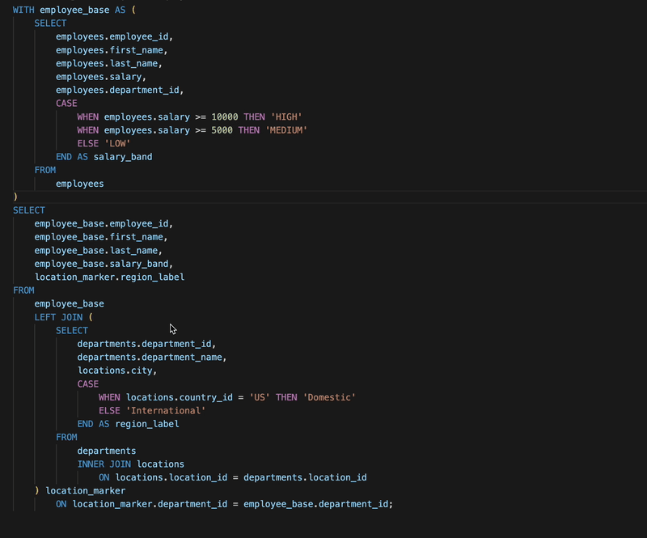
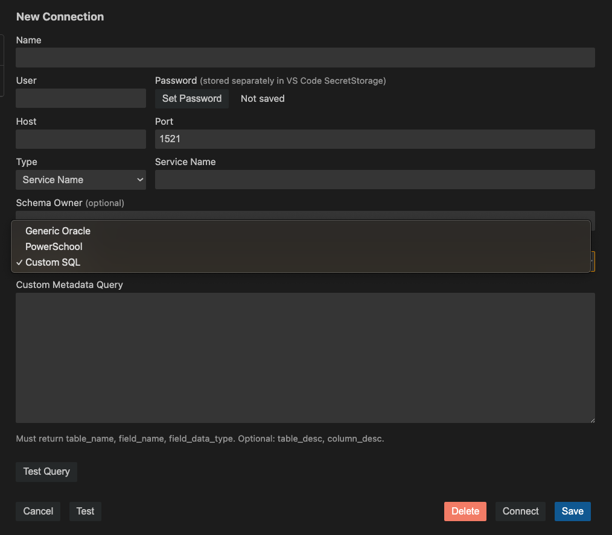

# oracle-cache-up README

OracleCacheUp caches Oracle database metadata locally to provide rich hover definitions for tables, views, fields, aliases, CTEs, and inline views directly in SQL files.

## Features

- Hover table definitions
- Hover field datatypes
- Resolve table aliases
- Resolve Common Table Expressions (CTEs)
- Resolve inline views
- Resolve derived CASE expressions
- Optional field and table descriptions
- Multiple saved Oracle connections
- Secure password storage using VS Code SecretStorage
- Generic Oracle, PowerSchool, and Custom metadata sources

## Requirements

Works with Oracle databases.

Includes built-in metadata support for:
- Generic Oracle databases
- PowerSchool Oracle databases

Custom metadata queries can also be configured for environments that store metadata in non-standard locations.

## Getting Started

1. Open any SQL file.
2. Right-click and select OracleCacheUp → Manage Connections.
3. Create a connection.
4. Save a password.
5. Refresh the metadata cache.
6. Hover Oracle objects to view definitions.

## Extension Settings

This extension contributes the following settings:

* `oracleCacheUp.connections`: Array of saved connections
* `oracleCacheUp.activeConnection`: Currently active/default connection
* `oracleCacheUp.showDescriptions`: Show/Hide table and field descriptions in the hover data (if available)

## Known Issues

Very large metadata caches (100MB+) may increase memory usage and impact hover performance.

## Release Notes

### 1.0.0

Initial Release.